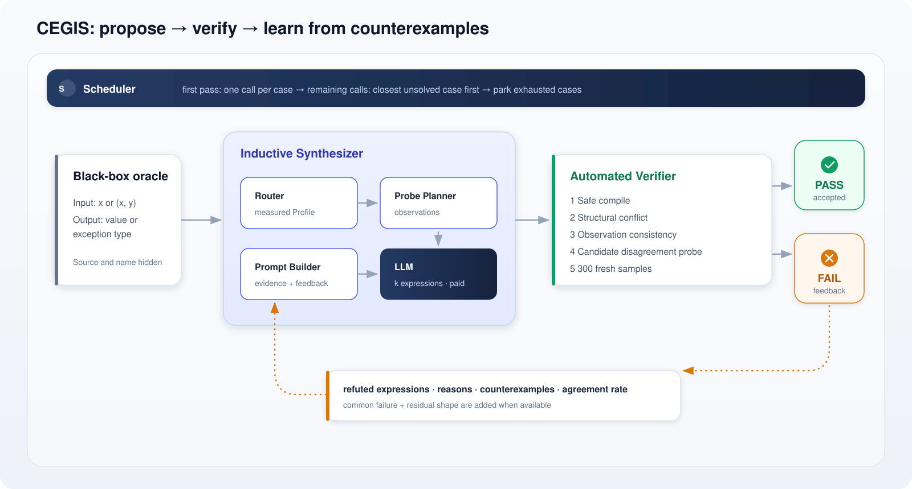
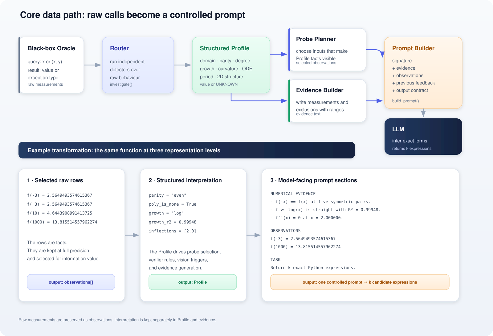
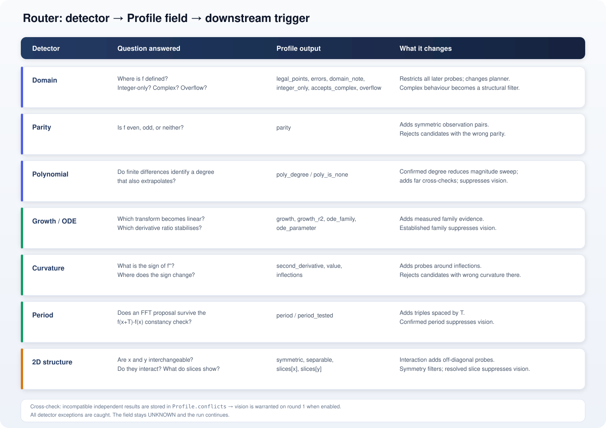
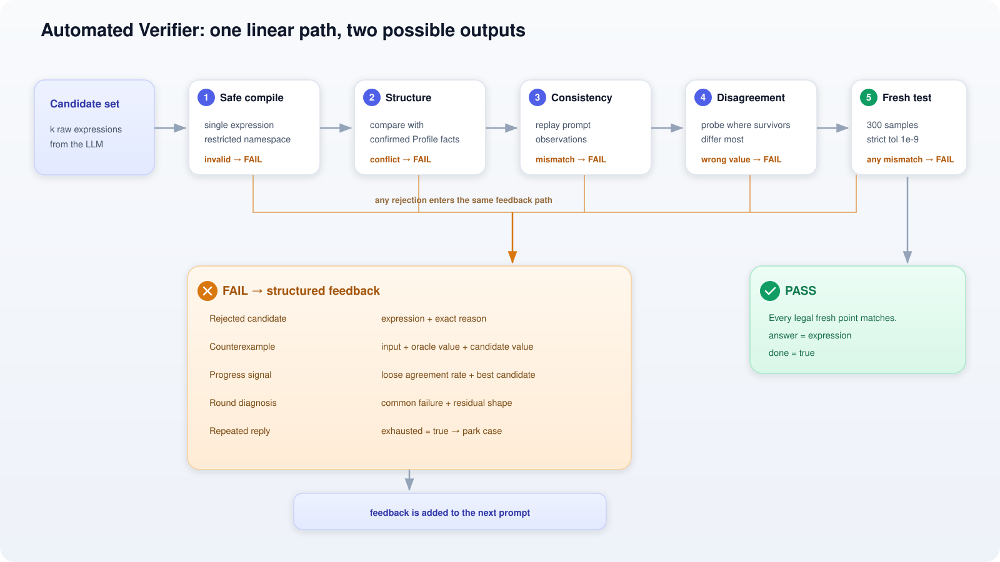
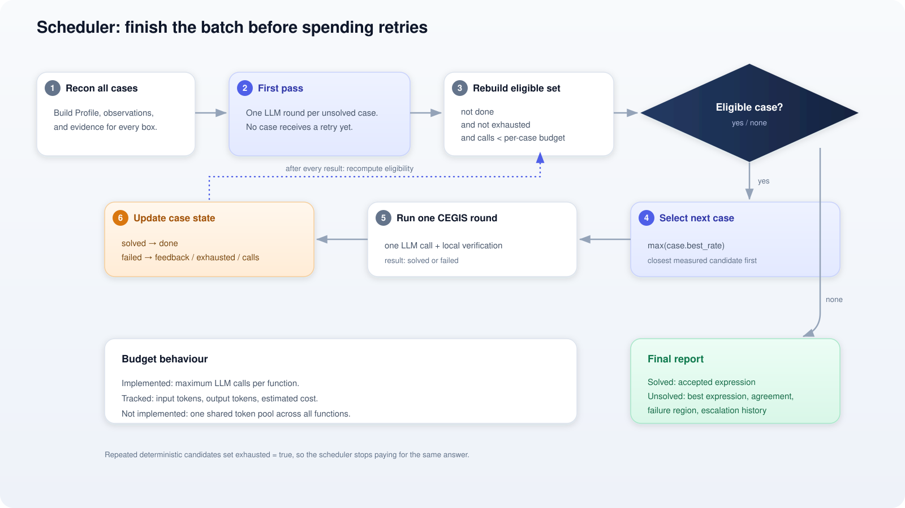
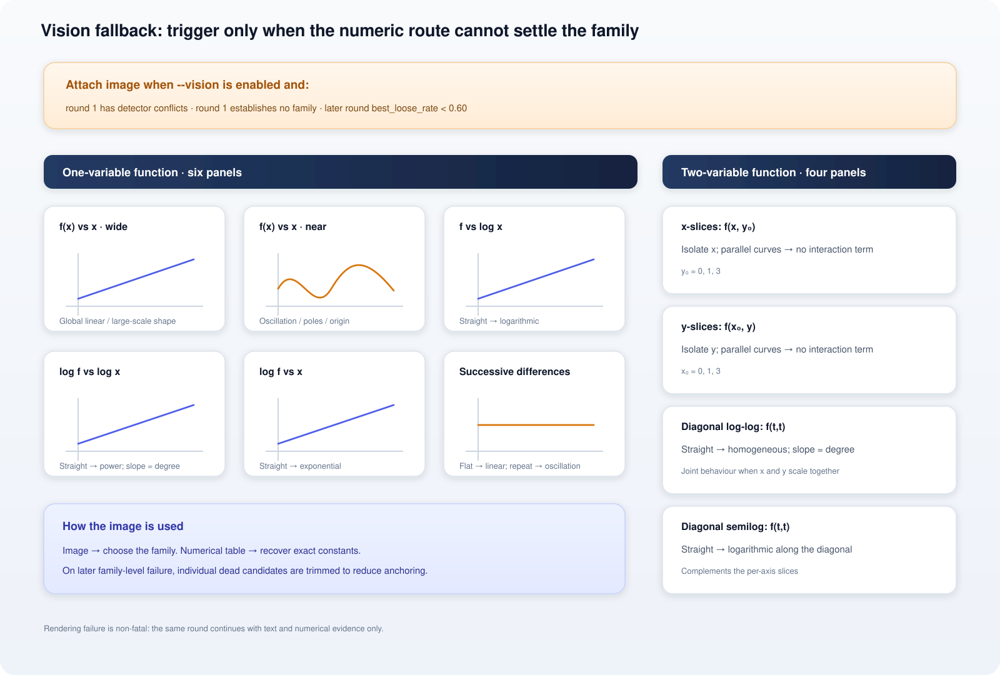

# Function Detective

Function Detective recovers the exact closed-form expression behind a hidden Python function. It probes the function as a black box, turns the results into structured, model-safe evidence, asks an LLM for candidate expressions, and verifies every candidate locally before accepting one.

```text
black-box queries → structured evidence → LLM candidates → local verification → exact expression
```

Recorded run: **6/6 solved · 1 LLM call per function · approximately $0.023**

## 1. How to run the project

### Requirements

The project depends on the Python packages listed in [`requirements.txt`](requirements.txt).

Those packages are installed through:

```bash
python -m venv .venv
source .venv/bin/activate
pip install -r requirements.txt
```

### Azure OpenAI configuration

The LLM is accessed through Azure OpenAI. The runtime expects a `.env` file with the following variables:

- `AZURE_OPENAI_API_KEY`
- `AZURE_OPENAI_ENDPOINT`
- `AZURE_OPENAI_DEPLOYMENT`
- `AZURE_OPENAI_API_VERSION`

Copy [`.env.example`](.env.example) to `.env` and fill in your own values.

### Running the detective

The main entry point is [`agent.py`](agent.py) ([`main()`](agent.py#L406)). With no arguments it runs every box in the registry:

```bash
python agent.py
```

Target a single box, or tune the search:

```bash
python agent.py --box BOX-C
python agent.py --k 3 --budget 5
python agent.py --vision
python agent.py --mock
```

Available targets are `BOX-A` through `BOX-F`, defined in [`secret_functions.py`](secret_functions.py). `--box` can be repeated to run a subset.

`--k` and `--budget` shape cost, not correctness. `--k` (default 5) sets how many candidate expressions are requested per LLM call; raise it when a function's family is genuinely ambiguous and a wider spread of candidates per round is worth the extra tokens. `--budget` (default 3) caps how many paid calls a single case may use before it is parked as `exhausted`; raise it for boxes expected to need retries. Both are read by [`agent.py — main()`](agent.py#L406) and enforced per case by the [scheduler](#6-failure-scheduling).

`--mock` replaces the LLM with an offline least-squares baseline, so the full pipeline — probing, verification, reporting — can be exercised without an API key or any cost. `--vision` additionally lets the prompt include rendered plots when the Router cannot settle on a function family from numeric evidence alone (see [§7](#7-vision-fallback)).

```bash
pytest          # offline tests; no API call
pytest --live   # add live API tests
```

Running the detective prints the Router profile, the selected probes, the LLM's candidates, each verifier decision, and the final report. See [`run_output.txt`](run_output.txt) for a complete recorded run.

## 2. System structure



Main controller: [`agent.py — Detective`](agent.py#L128) · [`agent.py — Detective.step()`](agent.py#L162)

```text
Inductive Synthesizer
    raw measurements → structured prompt → k expressions

Automated Verifier
    k expressions → local tests → accepted expression or feedback

Scheduler
    every case gets one call before any case receives a retry
```

Only the LLM request is paid — black-box probing, data preparation, rejection, counterexample search, and final verification all run locally.

## 3. Core mechanism: raw data to prompt



The system never hands the LLM a raw dump of black-box calls. Instead, it derives two parallel products from the same raw measurements:

```text
Profile       = compact machine-readable structure used by the program
Observations  = selected full-precision rows shown directly to the LLM
Evidence      = measured facts and scoped exclusions written for the LLM
```

### 3.1 Collect raw measurements

Implementation: [`reconnaissance.py — Oracle`](reconnaissance.py#L41)

`Oracle` wraps the hidden callable:

```python
value, error_name = oracle(*args)
```

Each call becomes one of:

```text
valid call     → (numeric_value, None)
failed call    → (None, exception_type)
non-finite     → (None, "NonFinite")
non-numeric    → (None, "NonNumeric")
```

Only the exception type is kept — the message is discarded, since it can leak the hidden function's name.

### 3.2 Convert measurements into a `Profile`

Implementation: [`reconnaissance.py — Profile`](reconnaissance.py#L94) · [`reconnaissance.py — investigate()`](reconnaissance.py#L665)

`investigate()` runs independent detectors over the black box:

```text
domain          legal points, errors, integer-only behaviour
complex         pure arithmetic vs math-module behaviour
parity          even, odd, or neither
polynomial      confirmed degree or polynomial excluded
homogeneity     scaling degree
growth          linear, logarithmic, power, or exponential transform
curvature       second derivative and inflection locations
ODE             stable derivative ratio and parameter
period          FFT proposal confirmed by f(x+T)-f(x)
2D structure    symmetry, separability, and one-variable slices
conflicts       incompatible results from independent detectors
```

Each detector returns a value or `UNKNOWN`; a detector failure never aborts the run.

Example structured output:

```python
Profile(
    arity=1,
    parity="even",
    poly_is_none=True,
    growth="log",
    growth_r2=0.99948,
    second_derivative="sign-changing",
    inflections=[2.0],
    ode_family="logarithmic",
    ode_parameter=1.9991,
)
```

### 3.3 Select model-facing observations

Implementation: [`planner.py — build_observations()`](planner.py#L122)

`build_observations()` uses the `Profile` to decide which raw values are useful enough to show the LLM.

```text
Profile result                 Selected observations
────────────────────────────────────────────────────────────────
parity measured               x and -x pairs
integer-only domain           integer inputs only
growth not obvious locally    inputs spread across decades
period T confirmed            x, x+T, x+2T triples
inflection located            points before, at, and after it
2D interaction detected       extra off-diagonal (x, y) points
low polynomial degree         a few far points for cross-checking
```

The stored row format is:

```python
((x,), value, error)
((x, y), value, error)
```

Full float precision is retained, since a value like `2.302585092994046` carries recognisable mathematical information that rounding would destroy.

### 3.4 Convert the `Profile` into evidence text

Implementation: [`evidence.py — build_evidence()`](evidence.py#L61)

`build_evidence()` converts structured fields into prompt-safe statements.

Allowed:

```text
MEASUREMENT  f(-x) and f(x) agree to 16 significant figures
EXCLUSION    no polynomial degree up to 6 survived extrapolation
SCOPE        tested over x in [2.2, 9.7e3]
```

Not allowed:

```text
GUESS        this is probably log(x² + 4)
```

Unknown fields are omitted, and every exclusion states the range over which it was tested.

### 3.5 Assemble the prompt

Implementation: [`synthesizer.py — build_prompt()`](synthesizer.py#L36)

`build_prompt()` combines the data products:

```text
FUNCTION SIGNATURE
    f(x) or f(x, y)

NUMERICAL EVIDENCE
    measured Profile facts + tested ranges

OBSERVATIONS
    selected (input → output) rows at full precision

PREVIOUS FAILURES                 # retry only
    expression + agreement rate + rejection reason

COMMON FAILURE                    # when available
    behaviour shared by rejected candidates

RESIDUAL ANALYSIS                 # when available
    shape of true value - closest candidate

VISION PANELS                     # when triggered
    alternate visual transforms of the same raw behaviour

OUTPUT CONTRACT
    exactly k lines: CANDIDATE n: <python expression>
```

The prompt never contains the function's source, implementation name, registry name, or raw exception message.

### 3.6 Parse the LLM response

Implementation: [`llm_client.py — AzureLLM`](llm_client.py#L99) · [`llm_client.py — parse_candidates()`](llm_client.py#L32)

Expected response:

```text
CANDIDATE 1: <python expression>
CANDIDATE 2: <python expression>
...
CANDIDATE k: <python expression>
```

The parser extracts expressions and removes duplicates. The LLM only proposes candidates — it never accepts an answer.

## 4. Router outputs and triggers



Implementation: [`reconnaissance.py — investigate()`](reconnaissance.py#L665) · [`planner.py — build_observations()`](planner.py#L122) · [`vision.py — family_established()`](vision.py#L44)

```text
integer_only = true
    → use integer probes
    → skip curvature, ODE, and period detectors

parity / inflection / accepts_complex / 2D symmetry
    → create structural verifier rules

polynomial / growth / ODE / period / homogeneity / resolved 2D slice
    → function family established
    → vision normally suppressed

period = T
    → add observations at x, x+T, x+2T

separable = false
    → add off-diagonal 2D probes

Profile.conflicts
    → trigger vision on round 1 when enabled
```

## 5. Automated verification



Controller: [`agent.py — Detective.step()`](agent.py#L162)

The filters run from cheapest to most expensive:

| Step | Implementation |
|---|---|
| Safe compile | [`adjudicate.py — compile_candidate()`](adjudicate.py#L48) |
| Structural conflict | [`adjudicate.py — structural_conflict()`](adjudicate.py#L91) |
| Observation consistency | [`adjudicate.py — consistency_failure()`](adjudicate.py#L136) |
| Version-space probe | [`adjudicate.py — most_discriminating()`](adjudicate.py#L151) |
| Absolute verification | [`adjudicate.py — agreement()`](adjudicate.py#L180) |
| Failure diagnosis | [`agent.py — diagnose()`](agent.py#L316) · [`adjudicate.py — residual_shape()`](adjudicate.py#L206) |

```text
1  Safe compile
   Accept one expression only; evaluate with empty built-ins and a math namespace.

2  Structural conflict
   Reject a candidate that contradicts confirmed Router facts.

3  Observation consistency
   Reject a candidate that cannot reproduce data already shown to the LLM.

4  Version-space probe
   Find the input where surviving candidates disagree most.
   Query the oracle and remove candidates that return the wrong value.

5  Absolute verification
   Generate 300 new samples across four numerical scales.
   Compare against the oracle with strict relative tolerance 1e-9.
```

### Success

```text
every legal verification point matches
→ case.answer = expression
→ case.done = true
```

### Failure

```text
feedback =
    rejected expression
    + rejection reason
    + counterexample, when available
    + loose agreement rate
    + common failure pattern, when available
    + residual shape, when available

feedback → next prompt
```

If every returned expression was already rejected, the case is parked: `case.exhausted = true`.

## 6. Failure scheduling



Implementation: [`agent.py — Detective.run()`](agent.py#L339) · [`agent.py — report()`](agent.py#L368)

```python
reconnoitre(all_cases)

# Every case receives one call before any retry.
for case in all_cases:
    if not case.done:
        run_one_llm_round(case)

# Reallocate remaining per-case call budgets.
while True:
    eligible = [
        case for case in all_cases
        if not case.done
        and not case.exhausted
        and case.llm_calls < max_calls_per_box
    ]
    if not eligible:
        break

    case = max(eligible, key=lambda c: c.best_rate)
    run_one_llm_round(case)
```

This keeps one difficult case from blocking the rest of the batch. The current implementation budgets LLM calls per function; it tracks tokens and cost but does not allocate a shared token pool.

## 7. Vision fallback



Implementation: [`vision.py — vision_warranted()`](vision.py#L72) · [`vision.py — render_1d()`](vision.py#L167) · [`vision.py — render_2d()`](vision.py#L206)

Vision is attached only when `--vision` is enabled and:

```text
round 1       Router detectors conflict
round 1       no detector establishes a family
later round   best_loose_rate < 0.60
```

Panel purpose:

```text
f vs x                    global linear or oscillating shape
f vs log(x)               logarithmic family
log(f) vs log(x)          power family; slope = exponent
log(f) vs x               exponential family
successive differences    linear or repeating behaviour
x/y slices                per-variable structure and interaction
diagonal log-log          2D homogeneity
diagonal semilog          2D logarithmic behaviour
```

The image helps select a family; full-precision observations still pin down the constants and verify the expression.

## 8. Code map

| File | Responsibility |
|---|---|
| [`agent.py`](agent.py) | CEGIS loop, case state, scheduler, report |
| [`reconnaissance.py`](reconnaissance.py) | Raw measurements → `Profile` |
| [`planner.py`](planner.py) | `Profile` → selected observations |
| [`evidence.py`](evidence.py) | `Profile` → measured prompt evidence |
| [`synthesizer.py`](synthesizer.py) | Evidence + observations + feedback → prompt |
| [`adjudicate.py`](adjudicate.py) | Candidate sandbox + filters + verification |
| [`vision.py`](vision.py) | Vision trigger + 1D/2D panels |
| [`llm_client.py`](llm_client.py) | Azure client + parser + token/cost tracking |
